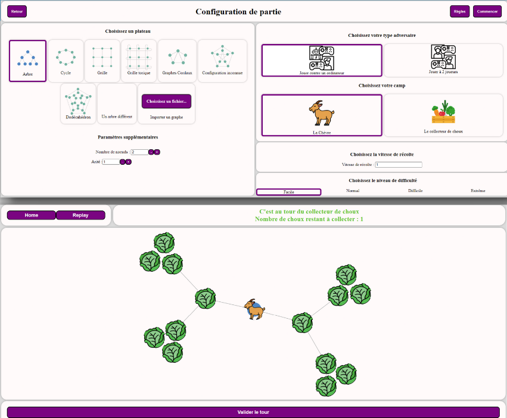

# CNRS/INRIA Summer Internship Project: Creation of a serious game for scientific mediation on graph theory

In 2014, Nicolas Nisse and the COATI team published an article providing results on the problem of data preloading (for web browsers, for example). Scientific popularization is a mission shared by INRIA and Terra Numerica. My internship is therefore fully in line with this objective of scientific mediation.

In computing, programs often require previously obtained data stored in a memory called "cache". One way of speeding up calculations is to anticipate these needs and "pre-calculate" data using auxiliary programs. This is known as "pre-fetching".
More precisely, prefetching is a technique that attempts to predict the information that will be needed by an electronic circuit or program, and to read this information before the circuit or program needs it, with the aim of speeding up the circuit or program and thus reducing computation times.
There's a balance to be struck between waiting time, and the memory space that preloading takes up with the amount of data to be preloaded. This problem can be found in many fields: web browsers (preloading web pages), video games (preloading graphic displays), etc...

The idea was to design a game that would help people understand that equilibrium has to be determined, and that it is possible to find it on certain graphs: The Surfer's Game (with a variation called the Goat and Cabbage Game).

## Representing the problem

To represent the problem, the authors of the paper had the following idea: Starting from the application of the problem on the website, the user is modeled by a goat, and the non-preloaded web pages by cabbages. The goat moves on a graph (a pair of sets (S, A) where S is a set of elements called vertices and A a set of elements called edges). The vertices are all initially occupied by cabbages. The idea is that if the goat lands on a vertex occupied by a cabbage, it eats it: this means that the browser starts to slow down (and then crash) as the user arrives on a page that is not pre-loaded. The aim of this turn-based game is to protect the cabbages from the goat, by playing as a cabbage collector who collects a limited number of cabbages each turn.

### Game Modelling

This version is therefore more playful for youngsters, and teaches them scientific concepts in a fun way. Within the game, we also have a more concrete version with the real application of the game. The user is represented by an avatar browsing a computer, and the pages to be preloaded by web pages.

The game can be played by 1 or 2 players. Users can play either the goat or the cabbage collector. The goat's aim is to eat a cabbage, and the cabbage collector's aim is to collect all the cabbages.

The goat is positioned at the start position, which is predefined for each graph. The cabbage collector is the first to play, and can harvest a certain number of cabbages per turn (this number is defined before the start of the game). Then, once the collector has finished harvesting the cabbages for his turn, the goat can move. It can only move to vertices adjacent to the vertex on which it began its turn. Then it's the cabbage collector's turn again.

The game is available here: [Jeu du Surfeur](https://www-sop.inria.fr/members/Yannis.Belkhiter/)

## Game development

The aim of my internship is to design the Websurfer game on the same model as the Gendarmes et du Voleur game designed by Grégory Hoareau: [Jeu des Gendarmes et du Voleur](https://www-sop.inria.fr/members/Gregory.Hoareau/)

Grégory was able to develop 2 playable game modes: Adventure Mode and Free Play Mode. Having had much more internship time than me (PFE and Master 2 internship, so almost 1 year in total), he was able to develop more features and game modes.

Given the length of my internship, I suggested a list of several tasks to be carried out in chronological order, laid out in a Gant diagram that we'll present later.

## Game modes

When we launch the game link, the home page appears:

- *Adventure mode*: This game mode is a narrative story played alone. It is made up of 4 blocks of increasing difficulty, enabling players to learn the various rules and subtleties of the game.

- *Free Play Mode*: This mode lets you play the WebSurfer game on any graph, with 1 player against a computer (with different levels of difficulty), or with 2 human players. It's finished, and fully functional.

The free play mode has two main aims:

- The first is to enable novice users to familiarize themselves with graphs. This will enable them to understand what the vertices of graphs are, what the edges between two vertices represent, and thus better grasp the possible moves on graphs, constituting the basic element necessary to progress in the game.

- This mode also enables Terra Numerica mediators to adapt to the levels and questions of those present. Mediators can also use this game mode as if they were using the game in a physical version.

## Edit mode

Edit mode lets you design any type of graph to play with in Free Play mode. These new graphs can also be implemented in new Adventure mode levels.

